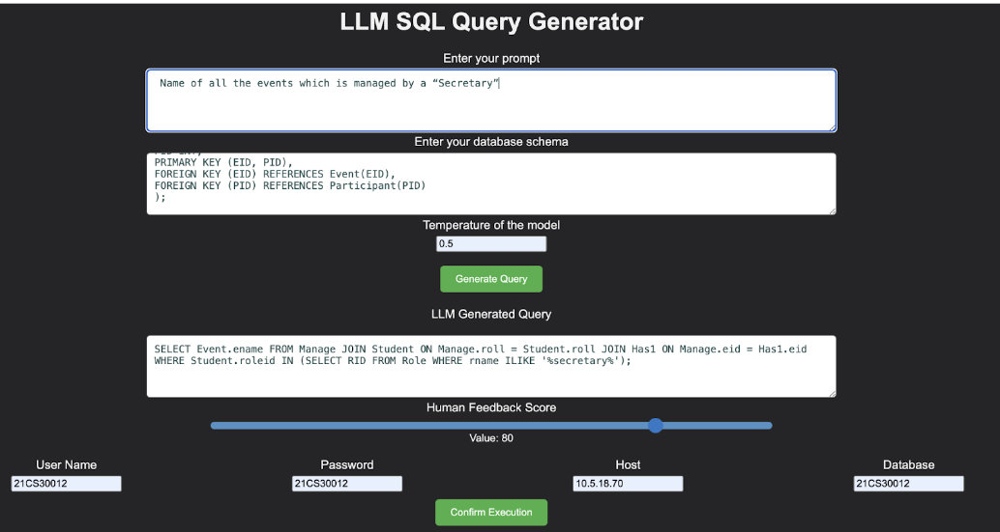
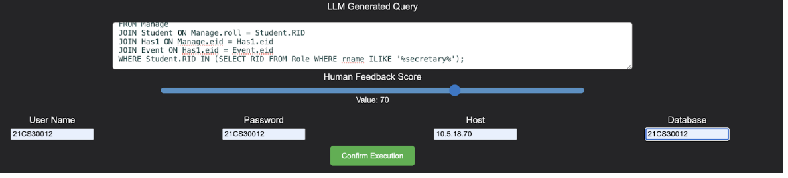
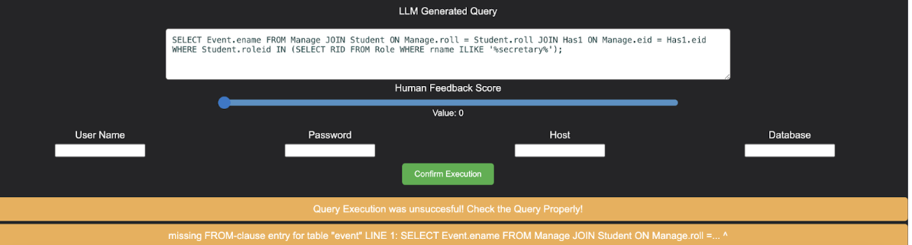

# LLM_SQL

## Installation and Running
use the following command  to install all the libraries 

```bash
pip install -r requirements.txt
```
use the following command to run the LLM SQL Generator interface

```bash
python3 main.py
```

 
 ## Model
SQLCoder is a 15B parameter model that is fine-tuned on a base StarCoder model. It slightly outperforms gpt-3.5-turbo for natural language to SQL generation tasks on the sql-eval framework, and outperforms popular open-source models. It also significantly outperforms text-davinci-003, a model that’s more than 10 times its size.

## Configuration
Architecture : Starcoder
Quantization: 4 bits (non-sparse)
Max_context_length = 8192
Embedding Length = 6144
Number of Layers = 40
Head_count = 48
Head_count_kv = 1
Parameters = 15 Billion

## User interface 



## SQL Query Execution 



## Data visualisation


## Error Handling



